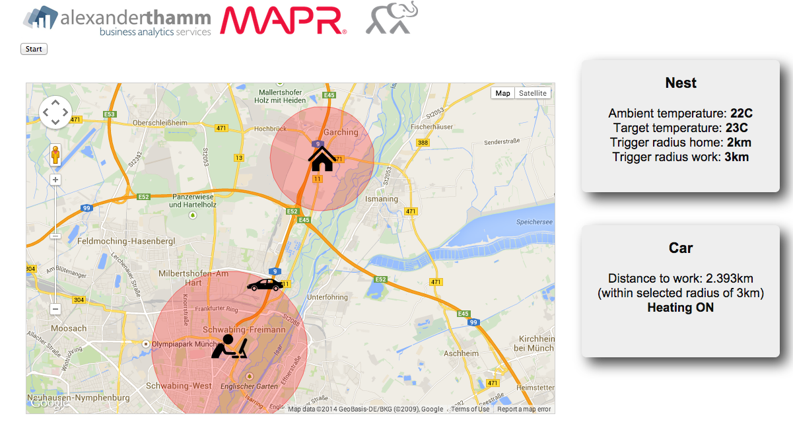

# Connected Car: Proximity Detection

This proof of concept shows the interaction between a connected car and a Nest 
unit controlling the temperature of a home. Further, a feedback channel into
the car was implemented, displaying the distance to home and confirming the
heating/cooling command is being executed.

Scenario:

> When the car is is leaving home (somewhere near AT), Nest receives the command
to switch OFF the heating and when car approaches work (VW Labs), Nest receives
the command to set heating to target temperature.

Further possible enhancements:

* Rather than necessitate the user to enter a trigger radius, calculate it on the fly based on heating characteristics
* Provide a more concise distance measurement (currently 'as the crow flies')
* Allow manual overwrite (rule-based, such as time or week day context)

## Demo

TBD: Note that a short demo video is available as a fallback.

### 1. Show ingest (optional)
To reset (clear) the database, go to the [WebUI](http://54.228.99.11:8083/) and execute:

    DROP SERIES car

Then, log into the EC2 instance (with password `mapr123`) and execute ingest from log:

    $ ssh ec2-user@54.228.99.11
    $ /home/ec2-user/loc-trigger-demo/fill-tsdb.sh
    
This ingests 3202 data points from `54.228.99.11/tmp/piin.20140921.log` into the TSDB.

### 2. Show time series (optional)

In the [WebUI](http://54.228.99.11:8083/) choose database `vw` and execute:

    SELECT * FROM car WHERE vehicleid='hinfahrtvw'
    
and this will yield `1685` data points (with an avg. 2 data points per second):

* start: `2014-09-21 18:55:36.266880` (epoch: 1411318536000)
* end: `2014-09-21 19:07:44.684526` (epoch: 1411319264000)

### 3. Trigger heating through proximity detection

#### Preparation

* Log into [Nest Home](https://home.nest.com/) and select the `Downstairs` thermostat.
* Set temperature to `22C`

Fire up the app server that serves the front-end in the browser by logging into
the EC2 instance (with password `mapr123`) and execute the following:

    $ ssh ec2-user@54.228.99.11
    $ cd /home/ec2-user/loc-trigger-demo/front-end/
    $ ./run-front-end.sh
    Serving HTTP on 0.0.0.0 port 6969 ...
    140.203.154.5 - - [22/Sep/2014 07:01:40] "GET / HTTP/1.1" 200 -
    140.203.154.5 - - [22/Sep/2014 07:01:40] "GET /style.css HTTP/1.1" 200 -
    140.203.154.5 - - [22/Sep/2014 07:01:40] "GET /js/jquery-1.11.1.min.js HTTP/1.1" 200 -
    140.203.154.5 - - [22/Sep/2014 07:01:40] "GET /js/concar.js HTTP/1.1" 200 -
    ...
    
Leave this terminal window open as control.

#### Simulation of car leaving home and approaching work

Before you start, make sure that the selected thermostat `Downstairs` is 
manually set to `22C` before you start the below.

Open a second terminal window to the EC2 instance (with password `mapr123`) and execute:

    $ ssh ec2-user@54.228.99.11
    $ cd /home/ec2-user/loc-trigger-demo/
    $ ./run-simulation.sh 23 2 3

This will switch off the heating if the car is more than `2km` away from
home and sets the target temperature to `23C` if it's closer than `3km` 
to work. A full [sample session](nest-control/example-session-output.md) is
also available.

Walter used settings 22 2 3 inorder to increase reproducability and was successful on 23.09.14

The front-end is at [54.228.99.11:6969](http://54.228.99.11:6969/):

Here, you just press the `Start` button (left, upper corner under the logos)
 AFTER the `run-simulation.sh` script has started and location data in the
following form is visible in the terminal:

    -----------------------------------------------------
    23 Sep 11:46:25 - At Sun Sep 21 2014 12:55:39 GMT-0400 (EDT) the car is 0km away from home.
    23 Sep 11:46:25 - At Sun Sep 21 2014 12:55:39 GMT-0400 (EDT) the car is 8.54km close to work.
    ...

Everything should work automatically from here on. Note that at any time you
can press the `Stop` button in the WebUI to stop the animation (this does, however
not stop the data flowing in, just the animation in the front-end).

## Testing and Deployment

To copy files to the EC2 instance:

    $ ./deploy-nest-control.sh

### Car setup: Raspberry Pi + GPS data schema

Schema of the log messages is:

    Timestamp;VehicleID;RPM;MPH;Throttle;Load;Fuel_Status;Latitude;Longitude;Altitude;GPS_speed
    2014-09-21 19:00:11.833169;hinfahrtvw;1313;33.5612181479;83.9215686275;56.862745098;NODATA;48.206595;11.630881667;477.3;15.156
    ...
    
### Nest client: AT/MapR connected car

Before you can programmatically access a Nest you need to define a [client](https://developer.nest.com/clients).

The OAuth credentials of the `AT/MapR connected car` client are:

* Client ID: `baa1a9e6-b0e0-484b-b250-66935fd39065`
* Client secret: `s0gAqbmbJDy7NYOAXynWsnGGF`
* Authorization URL: https://home.nest.com/login/oauth2?client_id=baa1a9e6-b0e0-484b-b250-66935fd39065&state=STATE
* Access Token URL: https://api.home.nest.com/oauth2/access_token?code=AUTHORIZATION_CODE&client_id=baa1a9e6-b0e0-484b-b250-66935fd39065&client_secret=s0gAqbmbJDy7NYOAXynWsnGGF&grant_type=authorization_code

In order to access the Nest, you need to authorize it once 
(note that if things fail, update `&state=attempt-N`) and try again from scratch:

    https://home.nest.com/login/oauth2?client_id=baa1a9e6-b0e0-484b-b250-66935fd39065&state=attempt-1

which yields a PIN code of something like:

    VASPUJ4X

This PIN code is then used to get an authentication token (valid for 10 years) 
which you can renew as so:

    $ ./renew-nest-token.sh
    Trying to get new auth token for client AT/MapR connected car
    {"access_token":"c.AycmBHVwPgoMfJ1Jj1BLl83UCwzVB9HoH7lxSqQmdTYlQ0JtjEvUUrG78fbeQrHindiCPHePJ6OQBFENPzRqTMrVWJ1tfl7DZ2OHfIQfdHGqbga5UGSXwPJww6ZUHPPp1PPueyY8BbBlno0v","expires_in":315360000}

Note: for now I manually copy/paste the access token into `nest-token`. If we
have time, I'll properly parse the JSON response of the Nest API and automatically
update `nest-token` so that it is sufficient to run the `renew-nest-token.sh`.

## To dos

* (Walter) Thoroughly test demo
* (Walter) Show current temp. at home in car
* (Walter) Implement iPhone/iPhone into demo
* (Walter) Activate smoke detector

## Resources

* [Nest API reference](https://developer.nest.com/documentation/api-reference)
* [Nest API Data Rate Limits](https://developer.nest.com/documentation/data-rate-limits)
* [JavaScript Sample Code](https://developer.nest.com/documentation/control) for Thermostat Control
* [ETA API](https://developer.nest.com/documentation/eta-reference)
* [Nest on Github](https://github.com/nestlabs)
