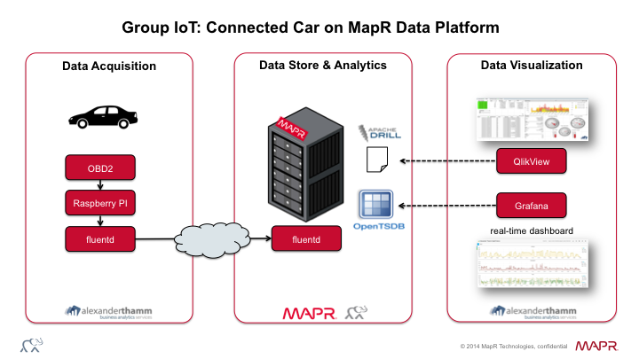
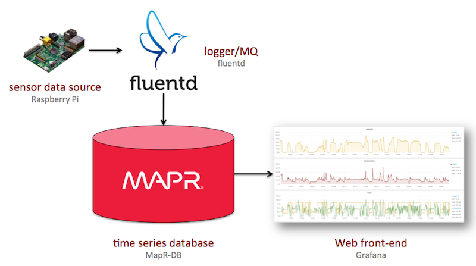

# Connected Car—Alexander Thamm/MapR

## VW demo

Integration with Nest (trigger heating when car close to home).

## Alexander Thamm Summer Event 2014 Demo

Took place on 18 Sep 2014 in Munich.

See also:

* Talk on [How we harness the torrent of sensor data in the context of the industrial IoT](talk/)
* White paper on [Data Processing in the Internet of Things (IoT)](whitepaper/)

### Static/One-off

Setup see [Raspberrypi-fluentd](Raspberrypi-fluentd/config.md).

### Real-time

Architecture as follows:

Setup see [fluentd-influxdb-grafana](fluentd-influxdb-grafana/config.md)

[Dashboard](http://54.228.99.11/#/dashboard/db/Alexander%20Thamm%20MapR%20Demo):

## Resources

* [Nest](https://developer.nest.com/)
* [InfluxDB](http://influxdb.com/)
* [Grafana](http://grafana.org/)
* [fluentd](http://www.fluentd.org/)
